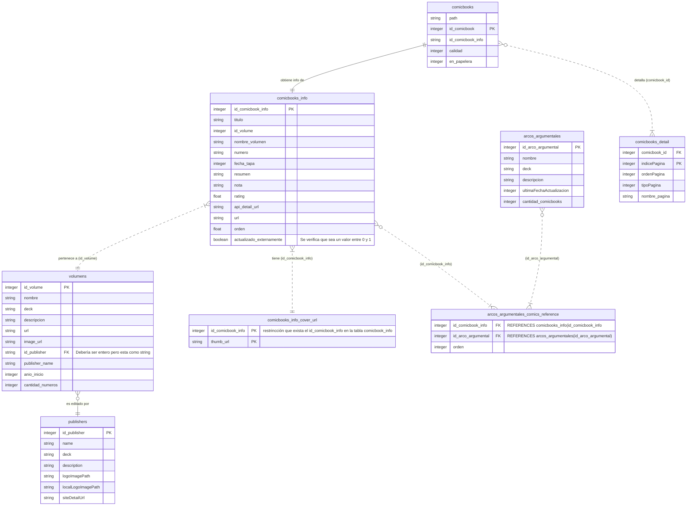

# BabelComic-II
Es un catalogador de comics. Este proyecto arranca por no tener una herramienta en linux como una muy conocida en el SO de la ventana. El autor de ese software dijo que no tenía intenciones de portarlo a linux asi que arranque con el propio. No intenta ser ni de cerca un clon de ese software el cual anda muy bien y es gratuito. 
Basicamente quiero tener una base de catalogo para mis comics y el que quierar usarlo que lo use. No tengo ni idea sobre como es el tema de licencias para su publicacion y esas cosas por lo cual es bastante amateur este proyecto y le voy metiendo horas cuando puedo. 
Actualmente BabelComics no tiene versión 1.0 porque considero que falta mucho por terminar.

# Funcionalidades deseadas para liberar versión 1.0
-------------------------------------
* ABM
  * Editoriales (falta implementar eliminación)
  * Serie o volumen tiene eliminacion pero no funciona de forma correcta
  * Comic (falta implementar completamente)
  * Arcos Argumentales (falta implementar completamente)
* Búqueda 
  * Las entidades implementadas lo tienen 
  * Las no implementadas no lo tienen
* visor o lector de comics (falta implementar completamente).
  * Hay mucho software que ya hace esto pero quiero agregar algo que no he visto en otros y dio orignen al nombre del programa.

# Funcionalidades deseadas a futuro
* Proceso de catalogación
  * implementado pero pendiente proceso de refactoring para no hacerlo dependiente de una GUI
* Ventana de estadisticas para poder ver cuanto tengo completo de arcos argumentales y volumenes. También poder ver los comics que se tienen repetidos y ese tipo de cosas.
* armado de procesos de formateo o normalización de nombres para poder organizar los comics a nivel de archivo.

# capturas
pepep

  
